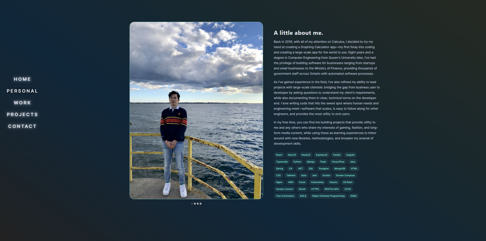

# Personal Website - Allen Tok

Please visit https://dev.allentok.com to enter my personal website!

This app was created and bootstrapped by NextJS using NextJS v13.0 with the /app router.

## Frameworks and Libraries Used:

- NextJS v14.0 using the /app router, Client Components (see /Components). Custom layout files for main app anchor routes for Navbar and Footer. As well as server actions for sending emails through ReSend (src/actions/resend.ts)
- ReactJS v18.2.0 with ES6 Arrow Function Components, Custom Hooks (see /hooks) and Standard React Hooks (useState, useEffect, useCallback, useMemo, useContext) as well as Context Providers for handling the active app section (see /context). Refer to /helpers for any helper functions used in components.
- TypeScript (Interfaces/Types/Unions) for props and function signatures.
- ESLint with Typescript Integration
- MaterialUI v5 with sx prop styling.
- TailwindCSS v3.4.1 used for lightweight bundling and fast, in-depth styling. As well as responsive design for any screen size.
- ReSend v3.2.0 for server actions defined in /src/actions which send automated emails through the form to my email address. 
- CSS Component Stylesheets (Flexbox and Grid) for more detailed css attributes that are necessary (linear gradients, custom background images).
- Icons8 for Static Assets

## Here are some screenshots from the web app:

